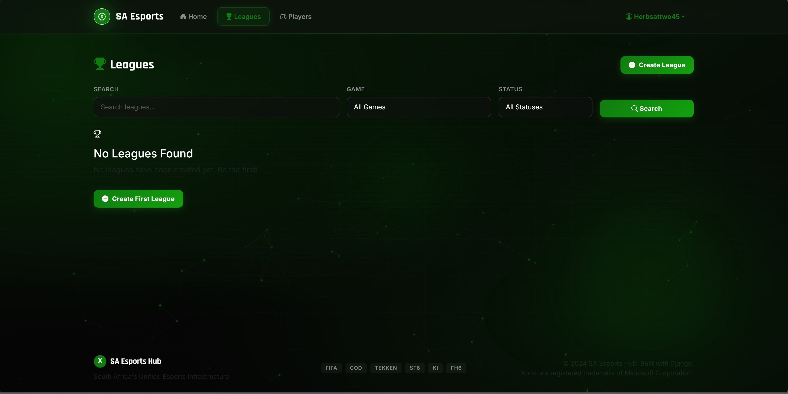

SA Esports Hub
Technical Design Document
Project Name: SA Esports Hub
Document Type: Technical Architecture
Document Version: 2.0
Date: 2026

What This Document Is
This document explains how SA Esports Hub is built from a technical standpoint. It covers the architecture, code structure, database design, security measures, and deployment setup. If you're a developer, technical reviewer, or system architect, this document gives you everything you need to understand the system.

Platform Walkthrough Video
A full walkthrough of the platform covering both the user interface and the administrative panel is available here:

▶️ Watch the SA Esports Hub Walkthrough https://youtu.be/e7ylTooO0Mk

The video covers: home page and animated backgrounds, league browsing, player rankings, account registration, player profile creation, tournament registration, scouting reports, and the custom admin panel.

System Overview
SA Esports Hub is a full-stack web application built with the Django framework. It follows Django's standard MVT (Model-View-Template) architectural pattern and uses a relational database to manage all competitive gaming data.

The platform is structured into three main Django apps that work together. The accounts app handles all authentication and user profile management. The leagues app manages tournaments, registrations, and match results. The players app handles competitive player profiles and the scouting system. Each app is self-contained but they share data through Django's ORM and foreign key relationships.

At the highest level, the system works like this. A user opens their web browser and visits the site. The browser sends an HTTPS request to the Django application server. Django's URL router determines which view function should handle the request. The view function processes the business logic, queries the database through the ORM, and returns an HTML template populated with data. The browser receives the rendered HTML and displays it to the user. For dynamic interactions like button clicks, animations, and form submissions, vanilla JavaScript handles the frontend behavior without requiring any additional framework.

Visual System Walkthrough

[Admin Dashboard](../images/admin_side.jpg)  

Based on the provided system imagery, the user and administrator journeys are distinctly powerful yet unified under a single Xbox-themed interface.

The Administrator Experience
The administrative dashboard acts as the central nervous system of the platform. When an admin like admin45 logs in, they are greeted by a real-time control center. The interface is divided into three critical operational zones:

The Status Bar (Top Right): This displays the current admin user (admin45) and the live server time (09:58:43), ensuring operators are synchronized with the live environment. The "SIGN OUT" button is prominently placed for security.

The Overview Hub (Top Left/Center): A grid of four live-statistic cards updates in real-time. It shows Active Leagues, Ranked Players, Registered Users, and Scout Reports. Next to this, a "Quick Actions" panel provides one-click shortcuts for common tasks like "Create League," "Add Player," or "Approve Signups," drastically reducing administrative overhead.

Live Activity Feed (Right Sidebar): This is a real-time log of all platform actions. As users register or leagues are created, entries like "User X created a profile" or "League Y was updated" appear here instantly, giving full visibility to the ecosystem.

The User Experience
While the admin sees the "engine room," the user sees the polished "showroom." The user interface is designed for discovery and competition:

The Browse Interface: The main content area allows users to filter available competitions by Game (FIFA, COD, TEKKEN) or Status (Active, Upcoming). A global search bar allows for instant lookup of specific leagues.

Dynamic Content States: The interface intelligently handles "empty states." If no leagues match the filter, the user sees a friendly "No Leagues Found" prompt with a clear call-to-action button to "Create First League" , turning a potential dead-end into an opportunity for community growth.

Brand Consistency: The Xbox-inspired green (#107C10), dark backgrounds, and consistent typography (Rajdhani/Inter) reinforce the "professional gaming hub" identity across both admin and user panels.

Technology Stack
The platform uses Django 4.2.7 as its backend framework because Django provides a complete batteries-included approach with built-in ORM, authentication, admin panel, and security features. Python 3.10 or higher is required for the language runtime.

For the database, the development environment uses SQLite which requires zero configuration and stores data in a single file. The production environment uses PostgreSQL 14 or higher because it scales better under load and supports concurrent connections.

On the frontend, Bootstrap 5.3.2 provides the responsive grid system and base components. Bootstrap Icons 1.11 handles all iconography throughout the site. Two Google Fonts are loaded — Inter for body text and Rajdhani for headings — to give the site a premium gaming aesthetic.

For production deployment, WhiteNoise 6.6.0 serves compressed static files directly from the Django application without requiring a separate web server. Gunicorn 21.2.0 is the WSGI HTTP server that runs the Django application in production. python-decouple 3.8 manages environment variables so secrets never get committed to source code.

Several additional packages support specific features. Pillow 10.1.0 handles image processing for user avatars and league banner uploads. django-crispy-forms 2.1 with crispy-bootstrap5 0.7 renders Django forms with Bootstrap styling.

Project Structure
The project is organized into a clean, maintainable structure that follows Django conventions. At the root level, there's a settings folder called sa_esports that contains the main project configuration including settings.py, urls.py, the WSGI entry point, and a custom admin module.

The accounts app contains the authentication logic. Its models.py defines the UserProfile model that extends Django's built-in User. The forms.py file contains the registration form with Gamertag validation, the styled login form, and the profile update forms.

The leagues app manages everything tournament-related. The models.py defines three models — League for the tournaments themselves, LeagueRegistration for tracking who signed up, and Match for storing individual match results.

The players app handles competitive player profiles. The Player model in models.py stores game-specific stats and rankings. The ScoutingReport model stores structured player evaluations.

Templates are organized in a top-level templates folder with subdirectories for each app. The base.html template provides the master layout with the navbar, footer, and animated background containers.

Static assets live in a top-level static folder. The xbox_theme.css file contains all custom styling including the animated background system and glassmorphic effects. The main.js file handles the particle network animation, scroll animations, counter animations, and button ripple effects.

Database Schema
The database design centers around Django's built-in User model which handles authentication. Every User has a corresponding UserProfile through a one-to-one relationship. The UserProfile stores the Xbox Gamertag, avatar image, role (player, scout, organizer, or spectator), South African province, biography, and Xbox profile URL.

A user can optionally create a Player profile through another one-to-one relationship. The Player model stores their primary competitive game, skill tier ranging from Bronze through Grand Master, ranking points, national rank, wins, losses, draws, tournament wins, scouting availability flag, looking-for-team flag, and a URL to their highlight reel.

The League model has a foreign key to User identifying the organizer. Each league stores its name, game type, description, format (single elimination, double elimination, round robin, Swiss system, or group stage), status (upcoming, active, completed, or cancelled), maximum participant count, prize pool in South African Rand, start and end dates, registration deadline, banner image, and rules text.

LeagueRegistration is a junction model connecting Users to Leagues. Each registration tracks its status (pending, approved, rejected, or withdrawn), timestamp, and optional notes. A unique constraint ensures a user can only register once per league.

The Match model records individual matches within a league. It references the league, both players, the winner, the scores for each player, the round number, when it was played, and whether it's marked as completed.

ScoutingReport connects scouts to players. Each report stores four ratings from 1 to 10 covering overall skill, mechanics, game sense, and consistency. It includes notes from the scout and a recommendation flag. A unique constraint prevents a scout from submitting multiple reports on the same player.

Authentication and Authorization
Authentication uses Django's built-in session-based system extended with the custom UserProfile model. The registration flow validates the form data including Gamertag uniqueness, creates a new User object, automatically creates the linked UserProfile, logs the user in, and redirects to the home page with a success message.

The login flow uses Django's authenticate function to verify credentials, creates a session, and redirects either to the originally requested page or to the home page. Logout requires a POST request for security, destroys the session, and redirects to the login page.

Authorization is enforced through a combination of Django's @login_required decorator and ownership checks within views. As seen in the Admin Side image, the dashboard provides elevated privileges including:

Viewing sensitive system metrics (Active Leagues, Scout Reports).

Accessing "Quick Actions" for direct database manipulation.

Viewing the "Live Activity" feed of all user actions.

Specifically, league editing and deletion is restricted to the organizer who created the league or any staff user. Player profile editing is restricted to the profile owner or staff. Scouting reports prevent users from scouting themselves and limit each scout to one report per player.

URL Routing
The URL structure follows RESTful conventions. The root URL serves the home page. Authentication URLs live under /accounts/ including /register/, /login/, /logout/, /profile/, and /player/<username>/ for viewing any user's public profile.

League URLs live under /leagues/ with the index showing all leagues, /create/ for the creation form, /<pk>/ for league details, /<pk>/edit/ for editing, /<pk>/delete/ for deletion, /<pk>/register/ for joining, and /<pk>/match/ for recording match results.

Player URLs follow the same pattern under /players/ with /, /create/, /<pk>/, /<pk>/edit/, /<pk>/delete/, and /<pk>/scout/ for submitting scouting reports.

The admin panel is mounted at /admin/ with all standard Django admin URLs underneath.

Frontend Architecture
The visual design follows an Xbox-inspired dark theme using #0E0E0E as the primary background and Xbox Green #107C10 as the accent color. Typography combines Rajdhani for headings (which gives a gaming aesthetic) with Inter for body text (for readability). The entire interface uses a mobile-first responsive approach through Bootstrap 5's grid system.

The signature visual feature is a multi-layered animated background system that runs behind every page. However, the primary functional layout is defined by the two reference images:

The Admin Grid (Admin Side.jpg): A dense, information-rich layout using stat cards (Overview), button groups (Quick Actions), and sidebars (Live Activity).

The User Browse View (User Side.jpg): A card-based or list-based layout focusing on searchability, filtering (by Game/Status), and "Call to Action" buttons (Create First League).

Interactive elements have layered animations. Buttons display a ripple effect on click, scale up slightly on hover, and have a glowing shadow. Stat cards (as seen in the Admin dashboard) animate their numbers from zero to the target value when scrolled into view. Player cards have a green accent bar that slides in from the left on hover.

Performance is carefully managed. CSS animations exclusively use transform and opacity properties which the browser can hardware-accelerate. The prefers-reduced-motion media query disables all animations for users with motion sensitivity.

CRUD Operations
The platform implements full Create, Read, Update, and Delete operations across all major resources, with appropriate permission checks for each operation.

User accounts can be created by anyone (Registration), read publicly, updated only by the owner, and deleted only by staff.

Leagues can be created by any authenticated user. As shown in the User Side image, if no leagues exist, the interface prompts the user to trigger the Create operation. Updating and deleting a league requires being either the organizer or a staff member.

League Registrations are created by authenticated users joining a tournament. Updating registration status (approving/rejecting) is a staff-only action, visible in the Admin dashboard's "Live Activity" or "Approve Signups" quick action.

Scouting reports can be submitted by any authenticated user but with two important restrictions. A user cannot scout themselves, and each scout can only submit one report per player.

Custom Admin Panel
The Django admin panel has been completely redesigned. As seen in Admin side.jpg, the interface moves away from Django's default blue/grey theme to a custom Xbox-themed interface that maintains all functionality while providing a dramatically better user experience.

Real-time Dashboard: The first thing an admin sees is the Real-time control center. This includes a live clock (09:58:43), the date (Thursday, 21 May 2026), and the "View Live Site" button.

Key Metrics: Four large cards display Active Leagues, Ranked Players, Registered Users, and Scout Reports. These act as both visual indicators and clickable shortcuts.

Quick Actions Panel: A row of six buttons (Scout Reports, Create League, Add Player, New User, Log Match, Approve Signups) allows administrators to bypass complex navigation menus.

Live Activity Feed: The right sidebar lists the latest 12 actions (Groups, User Profiles, Leagues, Registrations) with timestamps, giving the admin full visibility into real-time user behavior.

Deployment Architecture
The application deploys to Render.com's free tier which provides automatic HTTPS, continuous deployment from GitHub, and a managed PostgreSQL database. The deployment pipeline starts when code is pushed to the main branch of the GitHub repository. Render automatically detects the change, runs the build command which installs Python dependencies, collects static files with WhiteNoise compression, and applies any pending database migrations. After a successful build, Render starts the application using Gunicorn as the WSGI server.

Environment variables manage all secrets and environment-specific settings:

SECRET_KEY: Contains a strong random string generated separately for production.

DEBUG: Set to False to prevent error pages from leaking sensitive information.

ALLOWED_HOSTS: Restricts which domain names can serve the application.

The free tier has a few characteristics worth noting. After 15 minutes of inactivity, the service spins down and the next request takes 2 to 3 seconds for a cold start. Subsequent requests are fast (typically under 500ms). The database is limited to 256MB which is plenty for thousands of users and matches.

Future Enhancements
While the current platform is fully functional, several enhancements would expand its capabilities. Real-time match score updates via WebSockets would let spectators follow tournaments live. Email notifications would alert players about upcoming matches, registration deadlines, and ranking changes. Automatic tournament bracket generation would eliminate the manual work of creating elimination structures.

A team and clan management system would extend the platform beyond individual players to support multi-player squads. Payment integration for prize pools would enable automatic prize distribution to winners. Native mobile apps for iOS and Android would provide better access on phones.

Streaming platform integration with Twitch and YouTube would embed live broadcasts directly in league pages. A REST API would enable third-party developers to build companion apps and integrations.

Technical Skills Demonstrated
This project demonstrates competency across the full web development stack. On the backend, it shows mastery of Django's MVT architecture, ORM-based database modeling, function-based view development, form handling with validation, authentication and authorization implementation, and custom admin interface development.

On the frontend, it demonstrates responsive design with Bootstrap, advanced CSS including animations and glassmorphism, vanilla JavaScript programming, and the ability to create distinct interfaces for different user types (Admin vs. User).

On the infrastructure side, it covers production deployment with Gunicorn and WhiteNoise, environment-based configuration management, static file optimization, and database migration workflows.

Conclusion
SA Esports Hub represents a complete, production-ready web application built with industry-standard tools and best practices. The architecture is clean and maintainable, the security measures are comprehensive, and the user experience is polished. The codebase serves as both a functional platform for South African esports and a portfolio demonstration of full-stack Django development skills.

The technical decisions throughout the project balance simplicity with capability. Django provides power without complexity. The visual distinction between the high-density Admin Dashboard and the user-friendly Browse Interface shows a mature understanding of UX design principles.

This is the central digital infrastructure for South African esports — a unified system that finally gives competitive gaming in South Africa the professional home it has always deserved.

End of Technical Design Document

