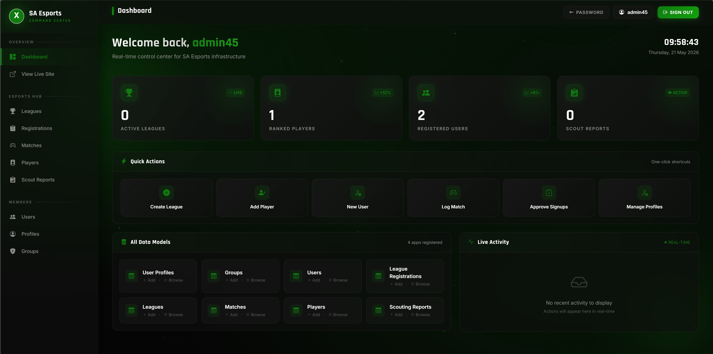

# SA Esports Hub  
**Technical Design Document**  
**Project Name:** SA Esports Hub  
**Document Type:** Technical Architecture  
**Version:** 2.0  
**Date:** 2026  

---

## What This Document Is
This document explains how SA Esports Hub is built from a technical standpoint. It covers the architecture, code structure, database design, security measures, and deployment setup. If you're a developer, technical reviewer, or system architect, this document gives you everything you need to understand the system.

---

## Platform Walkthrough Video
A full walkthrough of the platform covering both the user interface and the administrative panel is available here:

▶️ **Watch the SA Esports Hub Walkthrough:** [https://youtu.be/e7ylTooO0Mk](https://youtu.be/e7ylTooO0Mk)

The video covers: home page and animated backgrounds, league browsing, player rankings, account registration, player profile creation, tournament registration, scouting reports, and the custom admin panel.

---

## System Overview
SA Esports Hub is a full-stack web application built with the Django framework. It follows Django's standard MVT (Model-View-Template) architectural pattern and uses a relational database to manage all competitive gaming data.

The platform is structured into three main Django apps that work together:
- **accounts** – handles authentication and user profile management  
- **leagues** – manages tournaments, registrations, and match results  
- **players** – handles competitive player profiles and the scouting system  

Each app is self-contained but shares data through Django's ORM and foreign key relationships.

At the highest level, the system works like this:  
A user opens their web browser and visits the site. The browser sends an HTTPS request to the Django application server. Django’s URL router determines which view function should handle the request. The view function processes the business logic, queries the database through the ORM, and returns an HTML template populated with data. The browser receives the rendered HTML and displays it to the user. For dynamic interactions like button clicks, animations, and form submissions, vanilla JavaScript handles the frontend behavior without requiring any additional framework.

---

## Visual System Walkthrough

### Admin Side

### User Side

Based on the provided system imagery, the user and administrator journeys are distinctly powerful yet unified under a single Xbox-themed interface.

---

## The Administrator Experience
The administrative dashboard acts as the central nervous system of the platform. When an admin like **admin45** logs in, they are greeted by a real-time control center divided into three critical operational zones:

- **Status Bar (Top Right):** Displays the current admin user and live server time, ensuring synchronization with the live environment.  
- **Overview Hub (Top Left/Center):** A grid of live-statistic cards shows Active Leagues, Ranked Players, Registered Users, and Scout Reports. A “Quick Actions” panel provides one-click shortcuts for tasks like “Create League,” “Add Player,” or “Approve Signups.”  
- **Live Activity Feed (Right Sidebar):** A real-time log of all platform actions, giving full visibility into the ecosystem.

---

## The User Experience
The user interface is designed for discovery and competition:

- **Browse Interface:** Users can filter competitions by Game (FIFA, COD, TEKKEN) or Status (Active, Upcoming).  
- **Dynamic Content States:** If no leagues match a filter, a friendly “No Leagues Found” prompt appears with a “Create First League” button.  
- **Brand Consistency:** Xbox-inspired green (`#107C10`), dark backgrounds, and consistent typography (Rajdhani/Inter) reinforce the professional gaming identity.

---

## Technology Stack
- **Backend:** Django 4.2.7 (Python 3.10+)  
- **Database:** SQLite (development), PostgreSQL 14+ (production)  
- **Frontend:** Bootstrap 5.3.2, Bootstrap Icons 1.11, Google Fonts (Inter & Rajdhani)  
- **Static Files:** WhiteNoise 6.6.0  
- **Server:** Gunicorn 21.2.0  
- **Environment Management:** python-decouple 3.8  
- **Additional Packages:** Pillow 10.1.0, django-crispy-forms 2.1, crispy-bootstrap5 0.7  

---

## Project Structure
- **Root Folder:** `sa_esports` (settings, URLs, WSGI entry point)  
- **Apps:** `accounts`, `leagues`, `players`  
- **Templates:** Organized by app, with `base.html` as master layout  
- **Static Assets:** `static/` folder with `xbox_theme.css` and `main.js`  
- **Images:** `images/` folder for admin and user screenshots  

---

## Database Schema
- **UserProfile:** Extends Django’s User model with Gamertag, avatar, role, province, bio, and Xbox profile URL.  
- **Player:** Stores game stats, skill tier, ranking points, and scouting flags.  
- **League:** Tracks tournaments, organizers, format, prize pool, and dates.  
- **LeagueRegistration:** Junction model connecting Users and Leagues.  
- **Match:** Records individual matches, scores, and winners.  
- **ScoutingReport:** Connects scouts to players with ratings and notes.

---

## Authentication and Authorization
Uses Django’s session-based system with custom UserProfile.  
- Registration validates Gamertag uniqueness and auto-creates linked profiles.  
- Login authenticates credentials and redirects appropriately.  
- Logout uses POST for security.  
- Authorization enforced via `@login_required` and ownership checks.

---

## URL Routing
Follows RESTful conventions:
- `/accounts/` → register, login, logout, profile  
- `/leagues/` → index, create, edit, delete, register, match  
- `/players/` → index, create, edit, delete, scout  
- `/admin/` → custom admin panel  

---

## Frontend Architecture
Dark Xbox theme (`#0E0E0E` background, `#107C10` accents).  
Responsive design via Bootstrap grid.  
Animations use transform and opacity for performance.  
Reduced-motion support for accessibility.

---

## CRUD Operations
Full Create, Read, Update, Delete support across all resources with permission checks.

---

## Custom Admin Panel
Redesigned Xbox-themed interface with:
- Real-time dashboard and clock  
- Key metrics cards  
- Quick Actions panel  
- Live Activity feed  

---

## Deployment Architecture
Deployed on **Render.com** free tier with:
- Automatic HTTPS  
- Continuous deployment from GitHub  
- Managed PostgreSQL  
- Gunicorn + WhiteNoise  
- Environment variables for secrets (`SECRET_KEY`, `DEBUG`, `ALLOWED_HOSTS`)  

---

## Future Enhancements
- Real-time match updates via WebSockets  
- Email notifications  
- Automatic bracket generation  
- Team/clan management  
- Payment integration  
- Mobile apps  
- Twitch/YouTube streaming  
- REST API for third-party integrations  

---

## Technical Skills Demonstrated
- Django MVT architecture  
- ORM modeling  
- Authentication & authorization  
- Custom admin design  
- Responsive Bootstrap frontend  
- Vanilla JS animations  
- Production deployment with Gunicorn & WhiteNoise  

---

## Conclusion
SA Esports Hub is a complete, production-ready web application built with industry-standard tools and best practices. It serves as the central digital infrastructure for South African esports — a unified system giving competitive gaming the professional home it deserves.

---

**End of Technical Design Document**
